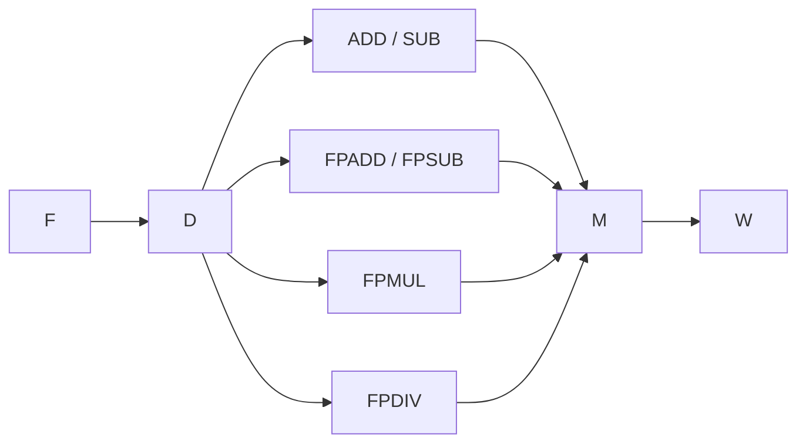
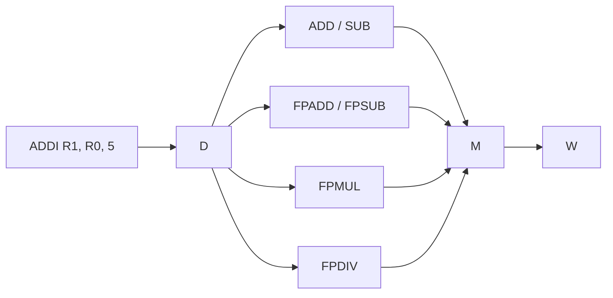
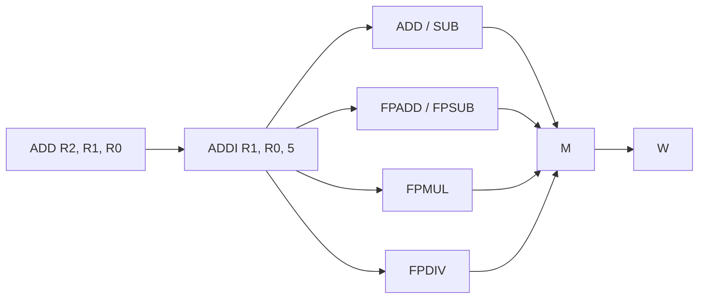
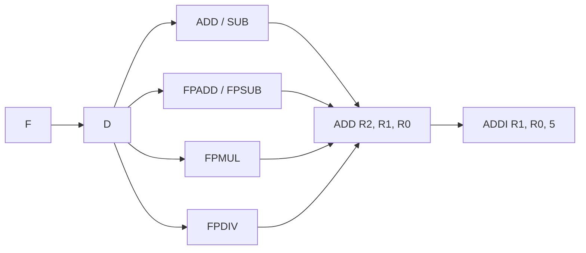
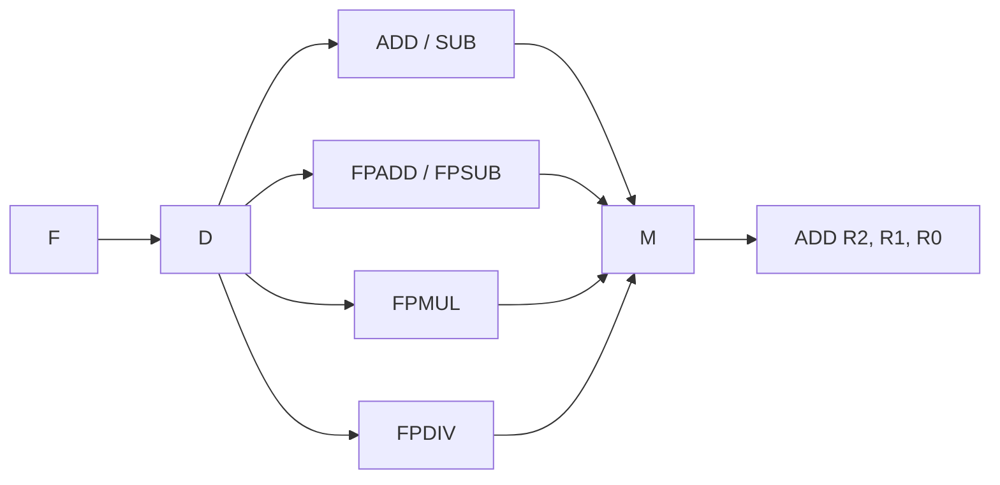

---
tags:
  - ASE
---

# MIPS64
## Pipeline

| F                                | D                  | E                                                                                                                                                                                                                       | M                                                            | W                                      |
| -------------------------------- | ------------------ | ----------------------------------------------------------------------------------------------------------------------------------------------------------------------------------------------------------------------- | ------------------------------------------------------------ | -------------------------------------- |
| Fetch                            | Decode             | Execute                                                                                                                                                                                                                 | Memory                                                       | Write Back                             |

- Fetch:
	- Fetch code instruction in memory
- Decode:
	- Decode the operation code fetched from memory
- Execute:
	- Execute the instruction in the ALU, there are 4 different units:
		- Arithmetic:
			1. Integer addition or subtraction
		- Floating Point:
			2. Addition or subtraction
			3. Multiplication
			4. Division
- Memory:
	- Interact with the memory with the result of the execute part
- Write Back:
	- Write back the result in the registers



A single instruction must complete all the steps to be considered completed, since we're using a RISC type processor, we consider all the non-floating-point steps to use **one clock cycle**, this means that, for example `ADD R2, R1, R0`,  we can expect 5 CKL waiting time for completion. 
Things drastically change when considering all the options really available during the execution of a program:
- multiple instructions
- using floating point operation
- branch misprediction
Particularly the last one will be discussed later in the [[#Branch Prediction]], specifically with the [[#Branch History Table - BHT|BHT]] and the [[#Branch Prediction Unit - BPU|BPU]].

For now let's consider multiple instructions (for simplicity sake, let's remain in the realm of integer numbers). Now we now that an instruction must follow all the steps, but what does the hardware of this step do when the instruction is on another part of the pipeline? Nothing! We cannot let inefficiency and waste of time prevail in a processor, and since all the steps are made to be independent one from the another we can start every instruction one at a time but with a delay of just 1 CLK (just the time for the previous instruction to leave the fetch stage).
Let's consider this portion of an asm code:

```ASM
[...]
ADDI R1, R0, 5
ADD R2, R1, R0
[...]
```

Here we load the value `5` inside `R1`, then we load the value of `R1` (it's just 5!) in `R2`, pretty easy right?

Let's consider now how the pipeline would process this two simple instructions:
Initially the pipeline is empty (let's consider the snippet is at the start of the program and no other instruction entered the pipeline)


Then the first instruction arrive and enters the fetch stage


At the next Clock Cycle the instruction leaves the fetch stage and start the decode stage, leaving the first stage (fetch) free to use and so we can optimize the pipeline filling it with the next instruction as follows:


The same logic continues until the very end where we can find the following situation:

The first instruction is ending with the write back stage and the second one is in the memory stage


In the next CLK the first instruction is out of the pipeline (has finished) and the second one occupy the write back stage


Of course this example is not a real use case, as was already said, this was extracted from a program, so almost certainly another instruction would have followed the second one, and so on until the end of the program.

This little example shows that although the first instruction need 5 CLK to complete, the next one (without considering any kind of hazard) will complete in the next clock cycle, creating a ideal **CPI** (**C**lock **P**er **I**nstruction) that will asymptotically reach 1: meaning a program that will require just one clock for every instruction to complete.
For comparison a new generation CPU can reach 5GHz (means 5 Billions of CLK per seconds), that means that in the perfect and ideal situation, this kind of processor could compute 5 **billions** instruction per second every second!


# Branch Prediction

When a branch instruction is executed, the result of the prediction is unknown until the condition is verified, thus, wasting some precious clock cycle as the verification occurs in the decode stage. 
This means that we need to make some prediction before knowing the result of the condition to optimized the pipeline and start fetching the right instruction after the branch. There are 3 possible way to predict a branch:
1. Always consider the branch taken/untaken (naïve approach)
2. Consider previous branch behavior 
3. Consider branch jump direction:
	1. Backward: likely a loop, treated as taken
	2. Forward: likely a if condition, treated as untaken

## Branch History Table - #BHT

Lower portion of the address branch instruction is used to access the table

n-bit to predict the branch

For every branch the bht is updated based on the type of action it performed (branch taken or untaken), for every branch taken the bht of that branch add a 1 and for every branch untaken it's bht subtract a 1.

Example:
```MIPS64
[...]
BNEZ R3, L1

L1:
[...]
```

Initially the bht is 0
if the branch is taken the value will update to 

### Algorithm

## Branch Prediction Unit - #BPU

# ARM
