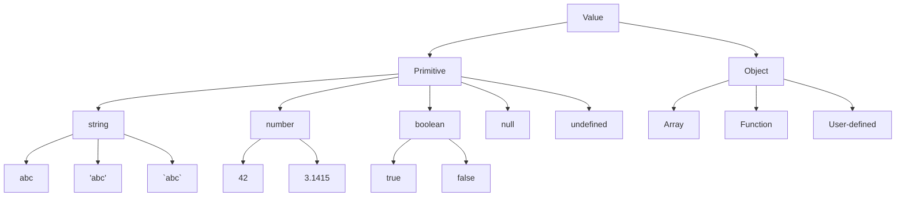

---
tags:
  - "#aw1"
  - s2
  - 2023-2024
  - "#js"
  - JSON
---
# JavaScript (basics)
#2024-03-05
"The" language of the web

We will use ES6 (2015) language features

## Outline
- [[#What is JavaScript?|What is JavaScript?]]
- [[#History and versions|History and versions]]
	- [[#History and versions#JavaScript Engines|JavaScript Engines]]
	- [[#History and versions#JavaScript Compatibility|JavaScript Compatibility]]
- [[#Language structure|Language structure]]
	- [[#Language structure#Lexical Structure|Lexical Structure]]
	- [[#Language structure#Strict Mode|Strict Mode]]
- [[#Types and variables|Types and variables]]
	- [[#Types and variables#Variables|Variables]]
- [[#Expressions|Expressions]]
	- [[#Expressions#Operators|Operators]]
		- [[#Operators#Assignment:|Assignment:]]
			- [[#Assignment:#Destructuring Assignment|Destructuring Assignment]]
		- [[#Operators#Comparison:|Comparison:]]
		- [[#Operators#Arithmetic|Arithmetic]]
		- [[#Operators#Bitwise|Bitwise]]
		- [[#Operators#Logical:|Logical:]]
		- [[#Operators#String|String]]
		- [[#Operators#Conditional (ternary):|Conditional (ternary):]]
		- [[#Operators#Comma|Comma]]
		- [[#Operators#Unary|Unary]]
		- [[#Operators#Relational|Relational]]
- [[#Control structures|Control structures]]
			- [[#Relational#Conditional Statements|Conditional Statements]]
			- [[#Relational#Loop Statements|Loop Statements]]
			- [[#Relational#Exception Handling|Exception Handling]]
- [[#Arrays|Arrays]]
			- [[#Relational#Creating an Array|Creating an Array]]
			- [[#Relational#Adding and Removing from Arrays|Adding and Removing from Arrays]]
			- [[#Relational#Copying arrays|Copying arrays]]
			- [[#Relational#Iterating over Arrays|Iterating over Arrays]]
			- [[#Relational#Main array methods|Main array methods]]
		- [[#Operators#Spread operator (3 dots: ...)|Spread operator (3 dots: ...)]]
		- [[#Operators#Curiosity|Curiosity]]
- [[#Strings|Strings]]
	- [[#Strings#Operations|Operations]]
	- [[#Strings#Methods|Methods]]
	- [[#Strings#Unicode issues|Unicode issues]]
	- [[#Strings#Template literals|Template literals]]


## What is JavaScript?
JavaScript [#js] is a programming language and is the only programming language that can be executed natively by a browser. 

With the help of Node.js it can also run on a computer like other programming languages.

It has **nothing** to do with #Java!
- similar name for marketing reason

The first version was made very quickly (10 days) and was based on company politics instead of technical reasons.

## History and versions

![[Pasted image 20240309113521.png]]

ECMAScript (ES) is the official name of #js standard
ES5 & ES6 were huge version of JavaScript then started the yearly cycles release.
This course will cover **ES2015 (ES6)**

### JavaScript Engines
- V8 (Google)
- SpiderMonkey (Mozilla)
- ChakraCore (Microsoft)
	- **was** used by Edge
- JavaScriptCore (Apple)

### JavaScript Compatibility
#js is backward-compatible but ***not*** forward-compatible:
- (backward) once something is accepted as valid #js, then future version of the program will always consider that code valid
- (forward) if something is implemented later, older version of the program will not be able to run that part and may cause crash.

To disable the use of old semantics of the language it was introduced the: [[#Strict Mode]]. 
There are pros and cons of using this mode:
- PROs:
	1. avoid using dangerous old snippet of the language from when it was created.
- CONs:
	1. Limiting the semantics also means compatibility issues with old systems.


## Language structure

### Lexical Structure
- One File = One #js program
	- Each file is loaded independently and different files may communicate through global state.
	- "module" mechanism provides state sharing in a clean way.
- The file is first parsed (**entirely**) and ***then*** executed: top->bottom
- Relies on a standard library:
	- many additional APIs provided by the execution environment
- JavaScript is written in Unicode, so it also supports special characters like emojis 😎
- semicolons (;) are not mandatory (auto inserted)
	- Debated argument in #js community
	- JS inserts them as needed when:
		1. next line start with code that break the current one
		2. next line start with "}"
		3. there is return, break, throw, continue in the current line
	- Because of the automation it could lead to unexpected behavior when the semicolon is not inserted manually:
		- New line ***does not*** equal semicolon, if the next line start with "(" or "\[" it is interpreted as a function call or array access.
	- To reduce the risk of unexpected behavior we will loosely follow the [Google style guide](https://google.github.io/styleguide/jsguide.html)
- Case Sensitive
- Comments like in C: /\*...\*/ and //
- Literals and identifiers $, _
- There are some reserved words
- C-like syntax

### Strict Mode
Directive introduced in ES5: `"use strict";`
- Compatible in older version (it's just a string, it will do nothing in version prior of ES5)
With this directive the code is executed in ***strict mode***:
- Fix some important language deficiencies and provides stronger error checking, security and improve performances (the same code with only  the directive `"use strict";` as difference, will result in a equal or faster program).

## Types and variables

Values have types. 
Variables don't. (this means that the same variables can contain string and then later used to identify numbers or Array)

<details>
<summary>Mermaid chart</summary>


</details>
![[Pasted image 20240309121417.png]]

In JS a value can be one of 8 different values, each of them groped in two categories:
- Primitive, group together 5 different values:
	1. String, can be written in 3 different ways:
		1. "abc"
		2. 'abc'
		3. \`abc\`:
			- this way is particularly useful when writing literal to avoid string concatenation
	2. Number, there are no differences between integers and floating point (automatic conversion according to operation)
		- NaN (not a number) is actually a number
	3. Boolean:
		- true/false
		- comparison:
			1. `a == b // convert types and compare results`
			2. `a === b // compare directly without conversion` 
		- When converting other types in Boolean we receive the so called: truthy/falsy values:
			1. 0, -0, NaN, undefined, null, ''(empty string): falsy
			2. Every other values is truthy:
				1. e.g. 3, 'false', [] (empty array),{} (empty object) 
	4. null: empty value
	5. undefined: this value is present when a variable is declared but not yet initialized
		- null and undefined called ***nullish values***
- Object:
	6. Array
	7. Function
	8. User-defined

### Variables
Variables are pure references: they refer to a value. The same variable can refer to different values of different types on different times. Variables can be declared in three (because of backward-compatibility 4, but we will not use as the strict mode will block us to do so):
1. let
2. const
3. var
4. implicit declaration
e.g. 
```javascript
"use strict";

let a = 5;
const b = 6.5;
var c = 'I\'m the c variable!'; //notice the escape character (\)
d = "not here"; //implicit declaration: unsupported in strict mode, 

a = "Hello World!"; // no errors
b = null; //ERROR: Cannot assign a new value with const
c = a; // no errors

let a = 4; // ERROR a already defined in this scope
function test(){
	let a = 4; //no error, variable a defined in a new scope
}

const b = 2; // ERROR b already defined
var c = 6; //no ERROR
```
There are a lot of nuances of how variables work

```javascript
"use strict";

Console.log(c); // only with var variable we can hoist the value before the initialization. The ouptuo will be undefined.

Console.log(a); //error: variable not defined.

var c = 59;
let a = 6;
```
 It is also important to specify how the const works:
 
 ```javascript
"use strict";

const a = 5;
a = 6; //ERROR: cannot assign a new value to const

const b = [3];
b.append(4); //no errors. Althought b is constant, you can change the object but something like:
b = [3,4]; //will not work as a new assignemnt of the variable b is forbidden.
```

Here a recap table of what can be done with the different declaration:
![[Pasted image 20240309131530.png]]

So now with most of the rule have been explained, it should come to no surprise the var should be avoided as it can make some unexpected behavior, and so it's recommended to use when possible ***const***, and for all the rest ***let***.
## Expressions
### Operators
#### Assignment:
 ``` javascript
let variable = expression // declaration with initialization
variable = expression // reassignment
```
##### Destructuring Assignment

Value of the right-hand side of equal signal are extracted and stored in the variables on the left
```javascript
let [x,y] = [1,2];
[x,y] = [y,x]; // swap
```
#### Comparison:
There two type:
1. Convert before compare
	- `==`
	- `!=`
	- `>`
	- `>=`
	- `<`
	- `<=`
2. Compare without converting:
	- `===`
	- `!==`

Comparing Objects has it's own nuances:
the comparison it's done to the ***reference***, this means that:
```javascript
a={x:1}
b={x:1}
(a==b || a===b) ==> false
```

The result is false because there are two identical object but in **different location** in memory 

#### Arithmetic
#### Bitwise
#### Logical:
- AND: &&
- OR: ||
- NOT: !

#### String

#### Conditional (ternary):

#### Comma

#### Unary

#### Relational

## Control structures
##### Conditional Statements
```javascript
//Single if else condition
if(condition){
	//if condition is truthy
	statement_1;
} else {
	//else go here
	statement_2;
}

//sequence of if else
if(condition_1){
	statement_1;
} else if(condition_2){
	//if condition_1 falsy and condition_2 truthy
	statement_2;
} ... else if(condition_n){
	statement_n;
} else {
	statement_last;
}

//switch statement
switch (expression) { //expression can be a string!  
	case label_1:
	    statements_1
	    [break;]
	case label_2:
	    statements_2
	    [break;]
	    …
	    default:
	    statements_def    
	    [break;] 
}

```
##### Loop Statements
```javascript
//while loop
while(condition){
	statement;
}
//do while loop
do{
	statement;
} while(condition);

//standard for loop
for([initExpression]; [condition]; [expressionAfterEachIteration]){
	statement;
}

//special for loop
for(variable in object){
	statement;
}

for(variable of iterable){
	statement;
}

//other iteration method
a.forEach();
a.map();
```

##### Exception Handling
```javascript
try{
//code
} catch(e){
 //handle the exception
} [finally{
	//execute in any case 
}]
```
## Arrays
- Rich of functionalities
- Elements don't need to be of the same type
- Simple syntax: []
- Property .length
- There are two method:
	1. Modify the array ***in-place***
	2. Return a ***new*** array
 
##### Creating an Array
There are two ways to create an array:
1. Using the brackets:
```javascript
let v = []; // make an empty array
//OR
let v = [1,2,3];
//OR
let v = [1, "hi", 3.1, true]; //heterogenous array
```

2. Using the method from the Array object:
```javascript
let v = Array.of(1,2,3);
//OR
let v = Array.of(1, "hi", 3.1, true); //heterogenous array
```

##### Adding and Removing from Arrays
The property .length adjusts automatically every time we modify the array.  
![[Pasted image 20240309142205.png]]

##### Copying arrays
```javascript
let v = Array.of("a", 8);

let alias = v; // reference of same array
let copy = Array.from(v); // create a shallow copy
```
![[Pasted image 20240309142439.png]]
##### Iterating over Arrays
- for ... of, for(...;...;...)
- [[#`.forEach(callback(currentValue, [index], [array]))`|forEach(f)]]
	- `f`: is a function applied to every element
- [[#`.every(callback)`|every(f)]], [[#`.some(callback)`|some(f)]] => return boolean
- [[#`.map(callback)`|map(f)]], [[#`.filter(callback)`|filter(f)]] => return new array where every element has the function f applied
- [[#`.reduce(callback, [initialValue])`|reduce(f)]]: execute a callback function on all items to progressibely compute a result => return single value 

Only the last 4 (forEach to reduce) are in [[#Functional Programming]] style
##### Main array methods 
- `.concat() 
	- joins two or more arrays and returns a new array. 
- `.join(delimiter = ',') 
	- joins all elements of an array into a (new) string. 
- `.slice(start_index, upto_index) 
	- extracts a section of an array and returns a new array. 
- `.splice(index, count_to_remove, addElement1, addElement2, ...) 
	- removes elements from an array and (optionally) replaces them, in place 
- `.reverse() 
	- transposes the elements of an array, in place 
- `.sort() 
	- sorts the elements of an array in place 
- `.indexOf(searchElement\[, fromIndex])`
	- searches the array for searchElement and returns the index of the first match 
- `.lastIndexOf(searchElement\[, fromIndex])`
	- like indexOf, but starts at the end 
- `.includes(valueToFind\[, fromIndex])`
	- search for a certain value among its entries, returning true or false


>[!Note] [[#Destructuring Assignment]]
> Value of the right-hand side of equal signal are extracted and stored in the variables on the left
``` JavaScript
let [x,y] = [1,2];
[x,y] = [y,x]; //swap
```

#### Spread operator (3 dots: ...)
Expand an iterable object in its parts
```javascript
let [x, ...y] = [1,2,3,4]; // we obtain y == [2,3,4]

const parts = ['shoulders', 'knees']; 
const lyrics = ['head', ...parts, 'and', 'toes']; 
// lyrics => ["head", "shoulders", "knees", "and", "toes"]
```

#### Curiosity
- Copy by value: 
	- `const b = Array.from(a) 
- Can be emulated by 
	- `const b = Array.of(...a) 
	- `const b = [...a]


## Strings
 - A string is an immutable ordered sequence of Unicode characters. It's **length** depend on the numbers of characters it contains (**not bytes**!).
 - Strings in #js use zero based indexing: empty string is the string of length 0.
 - There is no char equivalent in JavaScript, the result of `'a'` is a string of length 1
 - String literals can be defined either `'abc'` or `"abc"`
	 - ==ATTENTION==: for #JSON (**JavaScript Object Notation**) parsing only `"` can be used. 

 ### Operations
 - ***All*** operations always return new strings:
	 - Strings are immutable
 - Indexing
	 - s\[3]
 - Concatenation
	 - s1 + s2
 - Length of string (number of characters):
	 - s.length
		 - ==ATTENTION==: length is a parameter not a method! 
		   **.length**, NOT ~~.length()~~

### Methods
 - charAt, charCodeAt, codePointAt
 - indexOf
 - startsWith
 - concat
 - fromCharCode
 - split
 - slice
 - substring
 - match
 - toLowerCase
 - normalize
 - repeat
 - trim
### Unicode issues
Strings are a sequence of 16-bit Unicode \[0000, FFFF], when using the range \[010000, 10FFFF], their characters are represented by a pair of code units(occupying 2 index position), therefore some strings method may cause unpredictable results when working with characters above FFFF (like emoji 😎, flags 🇮🇹 etc.). 

### Template literals
Strings inside `` `backtick` ``  can embed expression delimited by `${}` where the result of the expression is interpolated into the string:
```JavaScript
let name = "Bill"; 
let greeting = `Hello ${ name }.`; 
Console.log(greeting); // greeting == "Hello Bill."
```


# JavaScript: Objects and Functions

## Outline
- [[#Object|Object]]
	- [[#Object#*Forget Java Objects*|*Forget Java Objects*]]
	- [[#Object#Properties|Properties]]
		- [[#Properties#Name(key)|Name(key)]]
		- [[#Properties#Value|Value]]
		- [[#Properties#Accessing Properties|Accessing Properties]]
		- [[#Properties#Accessing Errors|Accessing Errors]]
		- [[#Properties#Iterating Properties|Iterating Properties]]
	- [[#Object#Copying Object|Copying Object]]
	- [[#Object#Object Assignment|Object Assignment]]
	- [[#Object#Checking properties existence|Checking properties existence]]
	- [[#Object#Creation|Creation]]
- [[#Functions|Functions]]
	- [[#Functions#Introduction|Introduction]]
	- [[#Functions#Declaring Functions|Declaring Functions]]
	- [[#Functions#Return Value|Return Value]]
	- [[#Functions#Nested Functions|Nested Functions]]
	- [[#Functions#Closure|Closure]]
	- [[#Functions#Immediately Invoked Function Expression (IIFE)|Immediately Invoked Function Expression (IIFE)]]
	- [[#Functions#Construction Functions|Construction Functions]]
- [[#Dates|Dates]]
	- [[#Dates#Dates object|Dates object]]
	- [[#Dates#Day.js Library|Day.js Library]]
		- [[#Day.js Library#How to Install & Use|How to Install & Use]]
		- [[#Day.js Library#Goals|Goals]]
		- [[#Day.js Library#Functionality|Functionality]]
		- [[#Day.js Library#Plugins|Plugins]]
		- [[#Day.js Library#Advances topics|Advances topics]]

## Object
#2024-03-07
- An object is an unordered collection of properties (key: value)
- Store and retrieve value by the name (key) of the property
- Initialization is done by {}:
```javascript
let point {x:2, y:5}; //Object with two property: x,y and for each properties there is a value, respectively, 2,5
```


### *Forget Java Objects*
- Object May exists **without Classes**
	- Are created directly without deriving from a Class
- Objects are Dynamic:
	- add, delete, redefine property/method at *any* time
- Objects have no access control methods
	- every property/method is **always** public
- No real differences between properties and methods

### Properties
 #### Name(key)
  - Identified as a string
  - Must be unique in each object
	  - I can have 2 object with the same name but cannot have 2 equals name in the same object
  - Created at object initialization/Added after object creation (assignment)
  - Deleted after object creation
	 - `delete` operator
 #### Value
  - Reference to any js value
  - Stored inside the object
  - May be primitive types (number, string...), array, other object (you can have an object inside another object) or functions (methods)
	  - Remember: object store the reference, the actual value is ***outside***
#### Accessing Properties
- dot (.)
	- `let author = book.author`
- `["key"]`
	- it's important to remember that the square bracket except a string, so if you have a variable called "name" with a value of "Paolo" and you access the object with `[name]`, it will be translated to `["Paolo"]`
 If the name have space the only way to access it is from the `[]` notation

#### Accessing Errors
Although from the example before you may not have a key associated with "Paolo", if you try to access it, it will not throw an error, instead #js will assume you are trying to add a new key to the object and return undefined.
```javascript
let person = {
name: "Giorgio",
age: 23
};

let name = 'Paolo';

let myPersonName = person[name];

Console.log(myPersonName); // undefined
Console.log(person); // {name:"Giorgio", age:23, Paolo:undefined}
```

#### Iterating Properties
`for ... in` iterates over properties
```javascript
let book = { 
	author : "Enrico",
	pages: 340,
	chapterPages: [90,50,60,140]
}; 
for (const prop in book) 
	console.log(`${prop} = ${book[prop]}`); 
/*
author = Enrico 
pages = 340 
chapterPages = 90,50,60,140
*/
```

- the enumerable properties keys of an object can be accessed as an array with `let keys = Object.keys(my_objet);`
- All pairs `[key, value]` are returned as an array
- `let keys_values = Object.entries(my_object) `
  `[ [ 'author', 'Enrico' ], [ 'pages', 340 ] ]`

### Copying Object

```javascript
let book = { 
	author : "Enrico", 
	pages: 340, 
}; 
let book2 = book; // ALIAS
let book3 = Object.assign({}, book); // COPY
```

![[Pasted image 20240310122819.png]]
![[Pasted image 20240310122834.png]]

### Object Assignment
`let new_object = Object.assign(target, source);`
This method assigns all the properties from the source object to the target one, to make a copy of the object one could choose to set the target as a new object `{}` and thus copying all the value from an object to another
==ATTENTION==
This method create a shallow copy, so in the case of a nested object, when copied the new target object could make change of the original nested object as it has only the reference of nested object/array inside of it, and thus pointing to the original one.
This method can, obviously, performed on an already existing object, thus merging two different object into one. (Pay attention as the new object may contain reference of the old one, thus creating unpredictable results)

### Checking properties existence
The operator `in` will return true or false based on the key value
```javascript
let book = { 
	author : "Enrico", 
	pages: 340, 
}; 
console.log('author' in book); // true
delete book.author; 
console.log('author' in book); // false
```

==DO NOT USE WITH ARRAY:==
```js
const v=['a','b','c’]; 
console.log('b' in v); // false (unpredictable results)
```

### Creation
Object can be created in different ways:
1. literal: `const point = {x:2, y:5};`
	1. If you wanted an empty object: `const point = {};`
2. constructor: `const point = new Object();`
	1. 4. *constructor function* is also an option
3. static method `create()`: `Object.create({x:2, y:5});`

## Functions
### Introduction
Functions are one of the most important elements in every programming languages, those let them conquer specific task and abstract the logic of the program to create a more elegant and, in many cases, efficient code.
This is also the case for JavaScript.

Specifically, in #js the functions have multiple properties:
1. Delimits a block of code with a *private scope*
2. Can accept parameters (those can be both primitive **and** objects!) and return one value
3. Functions **are objects**
	- They can be assigned to a variable: `const sum = (a, b) => a + b;`
	- Can be passed as an argument: `const strange = (sum, a, b) => sum(a,b) * (a+b);`
	- Used as return value: 
	  ```js
	  const sumWrapper = (a,b) => {
		  const sum = (a, b) => a + b;
		  return sum;
	  }
		```


### Declaring Functions
There are three different ways to declare a functions. 

The classic declaration use the keyword `function`:
```js
// x is a parameter
function square(x) { 
	let y = x * x ; 
	return y ; 
} 

// here n will be equal to 16
let n = square(4) ;
```

The second way can be done in two ways 
```js
// creating a function with the name 'do' and assigning it to the variable 'fn'. Here the function could be invoked both using do() and fn()
const fn = function do(params) { 
	/* do something */ 
}

// same as above but the function as no name (it is called anonymous function) thus can be invoked only via the variable: fn() 
const fn = function(params) { 
	/* do something */ 
}
```

The third way is using the arrow
```js
// the concept is identical as the anonymous example above, the only difference is the absence of the keywork 'function' that is replaced by the arrow after the parameters space
const fn = (params) => { 
	/* do something */ 
}
```

The third method is also used when there is a specific need for a one time use function, just write the implementation of the function a single time as a parameter of another function and voilà: *les jeux sont faits*.
```js
//implement the condition from which filter an array
// simple array of number
let a = [1,2,3,4,5];

// when the function returns true keeps the value, otherwise discard them
a.filter((a) => a < 4); 

Console.log(a);
//Output: [1, 2, 3]
```


### Return Value
By default every function return `undefined`, if the function need to return a specific value with the keyword `return` undefined will be overwritten by the value after the `return` statement.
There is an exception to this: with the arrow function return may be implicit
```js
// if the arrow function is implemented using the bracket,
// the return keyword is needed
let fourth = (x) => { return square(x)*square(x) ; } 

// otherwise, like in this case, the function will
// consider the result of this operation as the return value
let fourth = x => square(x)*square(x) ;
```

### Nested Functions
The function can be defined everywhere, also inside another function.
```js
//(PREFERRED IN NESTED FUNCTION)
// arrow function defined inside another function
function hypotenuse(a, b) { 
	const square = x => x*x ; 
	return Math.sqrt(square(a) + square(b)); 
} 

// regular function defined inside another function
function hypotenuse(a, b) { 
	function square(x) { return x*x; } 
	return Math.sqrt(square(a) + square(b)); 
}
```

### Closure
Closure is one of the most important concept in #js. It is a feature of the language by which a ***nested*** function ***after*** the outer function ended can be still accessed in the outer scope.

```js
"use strict" ; 
//outer function
function greeter(name) { 
	const myname = name ;
	//nested function 
	const hello = function () { 
		return "Hello " + myname ; 
	} 
	
	//return the nested function
	//WARNING: return the function as an object, not his return value!
	return hello ; 
} 
// both the function below will return the function hello 
// with the myname parameter set to the corrispective name 
const helloTom = greeter("Tom") ; 
const helloJerry = greeter("Jerry") ; 

//here both the function ended and the nested function "hello" should be
// out of scope, but the console log below will not raise an error
// although they both are invoking an out of scope function!
console.log(helloTom()) ; 
console.log(helloJerry()) ;
```

Closure can be also be applied with object returned by a function (as function are object this is kind of a repetition) and thus can be used to emulate objects with methods.

### Immediately Invoked Function Expression (IIFE)
If there is a particular need to immediately invoke a function without using the two step:
1. Initialization
2. Invocation
It is possible to create those kind of function with the use of the parenthesis around the function and immediately after:
```js
//it is possible to assign this function to a variable
/*let num = */( function() { 
	let a = 3 ; 
	console.log(a) ; 
} ) () ;
```

And as above it can also be used to emulate objects with methods.
```js
"use strict"; 

const c = ( 
	function () { 
	let n = 0; 
	return { 
		count: function () { 
			return n++; }, 
		reset: function () { 
			n = 0; } 
		}; 
	})();

console.log(c.count()); // 0
console.log(c.count()); // 1
c.reset(); 

console.log(c.count()); // 0
console.log(c.count()); // 1
```

### Construction Functions
Those type of functions are used to define the object type and are a little different from the regular function:
1. Uses a capital initial letter 
2. Set the property with the keyword `this`
```js
// note the capital letter
function Car(make, model, year){
	// note the usage of 'this'
	this.make = make;
	this.model = model;
	this.year = year;
	this.isNew = () => (year > 2000);
}
```

To initialize a new object use the keyword `new`
```js
let mycar = new Car('Eagle', 'Talon TSi', 1993);
```

## Dates
### Dates object
#2024-03-12
JavaScript has a date object inside of it that manage years, days, hours etc. with millisecond precision, counting from #1970-1-1 (Unix Epoch).
But it has a really bad time dealing with time zones: all method applied to Date object works only in local time (the computer default time zone), so it is difficult to compare times between different time zone.

How to create a Date object
```js
// create Date object
let now = new Date();

let newYearMorning = new Date( 
		2021, // Year 2021 
		0, // January (from 0) 
		1, // 1st 
		18, 15, 10, 743 // 18:15:10.743, local time
	); 
```

But because of it's intrinsic problem this course will use an external library called [day.js](https://day.js.org/)
- small library with high modularity
- kind of a spiritual successor of [momentjs](https://momentjs.com/)

### Day.js Library
#dayjs
#### How to Install & Use
To install using npm:
```
npm init
npm insatll dayjs
```

Then in JavaScript
```js

// import
const dayjs = require('dayjs');

//use
let now = dayjs(); // return today date
console.log(now.format()) // the format method let high configuration on the output 
```

#### Goals
The goal of this library is:
- Compatibility with moment.js while remaining very small (~2kB)
- Working both in nodejs and in the browser
- ***Immutable*** object
	- All #API that modify a date returns a new object instance
- Localization
- Extending functionality via plugin
#### Functionality
There are different methods to modify a date
- `.add` - `.subtract`
- `.startOf` - `.endOf`
- `d1.diff(d2, <time_unit>)`

And also multiple methods to comparing them
- `.isBefore` - `.isSame` - `.isAfter`
- `.isBetween`
- `.isLeapYear` - `.daysInMonth`

Some methods may require plugins to functions!
#### Plugins
Plugins are extra functionality that aren't present in the default installation of dayjs but can be easily added in the program. 
To use a Plugin they must be in order:
1. Loaded
2. Registered into the libraries

An example that require a plugin is `.isLeapYear()`
```js
// load plugin
const isLeapYear = require('dayjs/plugin/isLeapYear'); 

// register plugin
dayjs.extend(isLeapYear);

// now the method can be used
console.log(now.isLeapYear());
```

#### Advances topics
Day.js helps with localization and internationalization with features like language-aware and locale-aware parsing and formatting but also with measurement of durations between two time instant and time zone conversion.


# Asynchronous Programming in JS
## Outline
- [[#Callbacks|Callbacks]]
	- [[#Callbacks#Synchronous|Synchronous]]
- [[#Functional Programming|Functional Programming]]
	- [[#Functional Programming#Features|Features]]
	- [[#Functional Programming#Implementation in JavaScript|Implementation in JavaScript]]
	- [[#Functional Programming#Iterating over Arrays|Iterating over Arrays]]
		- [[#Iterating over Arrays#`.forEach(callback(currentValue, [index], [array]))`|`.forEach(callback(currentValue, [index], [array]))`]]
		- [[#Iterating over Arrays#`.every(callback)`|`.every(callback)`]]
		- [[#Iterating over Arrays#`.some(callback)`|`.some(callback)`]]
		- [[#Iterating over Arrays#`.map(callback)`|`.map(callback)`]]
		- [[#Iterating over Arrays#`.reduce(callback, [initialValue])`|`.reduce(callback, [initialValue])`]]
		- [[#Iterating over Arrays#`.filter(callback)`|`.filter(callback)`]]
- [[#Asynchronous Programming|Asynchronous Programming]]
- [[#Database Access with SQLite|Database Access with SQLite]]
- [[#Promises|Promises]]
- [[#async/await|async/await]]
## Callbacks
Callback function is a function passed into another function as an argument, which is invoked inside the outer function. The callbacks could be both #Synchronous and #Asynchronous

### Synchronous
Mainly used in functional programming, like providing the sort criteria for array sorting.
```js
let nums = [3, 4, 1, 9, 10, 3];

// the arrow function is a callback!
nums.sort((a,b) => b-a);
// [1, 3, 3, 4, 9, 10]
```

## Functional Programming
A programming paradigm where the developer mostly construct and structure code using functions
> JavaScript was not designed for this paradigm but is still well suited for it.

It uses more a declarative rather than an imperative one, thus improving readability:
***Declarative***
```js
new_array = array.filter(<filter_function>);
```

***Imperative***
```js
new_array = [];
for (const el of list) 
	if ( filter_function(el) ) 
		new_array.push(el) ;
```
### Features
-  functions can be used as if they were variables or constants, combined with other functions and generate new functions in the process, chained with other functions, etc. 
- Higher-order functions 
	- a function that operates on functions, taking one or more functions as arguments and typically returning a new function 
- Function composition 
	- composing/creating functions to simplify and compress your functions by taking functions as an argument and return an output 
- Call chaining 
	- returning a result of the same type of the argument, so that multiple functional operators may be applied consecutively
### Implementation in JavaScript
JavaScript supports all those features "out of the box", but in addition it also support other features as well that break the #functionalProgramming paradigm. The only way to use this paradigm in #js is to ***avoid mutability*** at all cost:
- do not change object in place!
	- changing an array must result in a new array returned

### Iterating over Arrays
[[#Iterating over Arrays]]

#### `.forEach(callback(currentValue, [index], [array]))`
invokes a synchronous callback function once for each element of an **iterable**
```js
const letters = [..."Hello world"] ; 
let uppercase = "" ; 
letters.forEach(letter => { 
	uppercase += letter.toUpperCase(); 
});
console.log(uppercase); // HELLO WORLD
```
- The callback may have 3 parameters:
	1. `currentValue`: the current element being processed
		- from the example above: `letter` is the `currentValue` parameter
	2. `index`(optional): index of the `currentValue` in the array
	3. `array`(optional): array `forEach()` was called upon
- return `undefined` and is ***not*** chainable
- the only way to exit the loop is to throw an exception (**don't do it**)
The `forEach()` function **does not** mutate the array but the callback **may do** so
#### `.every(callback)`
This function tests whether ***all*** elements in the array pass the test implemented by the callback and return a Boolean value accordingly. If during the iteration over all the elements the function find a value that does not satisfy the condition immediately returns ***false*** (better performance) 
#### `.some(callback)`
This function tests whether ***at least one*** element in the array pass the test implemented by the callback and return a Boolean value accordingly. If during the iteration over all the elements the function find a value that satisfy the condition immediately returns ***true*** (better performance) 
#### `.map(callback)`
This function passes each element of the array one at a time as the argument of the callback. The callback should return a value and each value will be in the ***new array*** returned by the `.map()` method. 
#### `.reduce(callback, [initialValue])`
it combines the elements of an array, using the callback, to produce a single value.
>this is a common operation in functional programming and goes by the names “inject” and “fold”

#### `.filter(callback)`
It creates a ***new array*** with all the elements that return a Boolean true inside the callback, if no element passes the test it will **return** an **empty array**


## Asynchronous Programming
#2024-03-21

Asynchronous programming let the single thread-by-design JavaScript execute code in a more responsive way. The program still remain single threaded but when an asynchronous method is called it is pushed in a stack of methods were another polling mechanism check if the time is come for that program to be executed, from which there could be two possibilities :
- Not ready: continue polling without doing anything
- Ready: the method is moved in the queue of instruction to be executed

Of course this does not guarantee that an asynchronous method that need to be operated by a timer will actually be executed Switzerland clock precise, but it's close enough to create a more responsive environment for the user.

```js
const onesec = setTimeout(() => {
	console.log('hey');
}, 1000); //1000ms => 1s

console.log('hi');
```
The program above use the `setTimeout(callback, time_in_ms, [...callback_params])` native #asynchronous method to print in the console `hey` and then invoke another log `hi`. The program will initialize the `onsec` function and push it in the polling stack, waiting to be executed, then execute the #synchronous method immediately after, and so we can expect the console to show the following behavior:
```js
hi
// wait 1 second
hey
```

As said before when the #async function is ready to be execute it will just populate the queue of instruction, so if the `console.log('hi');` were instead an heavy algorithm that will take 5 second to complete, we will face with the following condition:
```js
const onesec = setTimeout(() => {
	console.log('hey');
}, 1000); // 1000ms => 1s

(() => {
	... // imagine a 5 second algorithm
	console.log('Done');
})(); // the function is immediately executed and print Done when finish

//// Output
//start
//onesec initialized and pushed in the waiting area
//anonym function initialized and started executing
//after ~1 sec the "onesec" finished waiting and is moved in the queue but cannot be executed as the other method is still executing
//after another 4 sec the anonym function finished
Done
//immediately after the queu continue executing the onesec
hey
```

So the async will not set when the method will execute, instead when the method will be inserted in the queue to be executed (if queue empty the time of waiting will be zero, and so  it will seems as the expected behavior)

### Primitive #async method
- `setTimeout()`
	- will execute the callback function one time when the timer reach zero
- `setInterval()`
	- as the timeout but will continue periodically 

### Handling Errors in Callbacks
No official way, just best practice
Usually the callback will have two arguments => `(err, data)`
And so the best way to handle a function is
```js
fs.readFile('/file.json', (err, data)) => {
	if(err !== null){
		console.log(err);
		return;
	}
	// no error process data
	console.log(data);
}
```

## Database Access with SQLite 
SQLite is an SQL-*Like* database, and so will use the same syntax to query the table, the main difference between this solution and others SQL-*like* is the way it manage the database.
> The database is a ***single*** file

This solution have pros and cons:
- Pros:
	- Easy to manage a small application as there is no need to run instance of a database process to handle the data
	- Easy to share, it's all in one file! (no need to make a dump file)
	- Use same syntax as other big #db,  very easy after a prototype have being made to switch to a more robust system
- Cons:
	- Very slow with big tables or very complex query (impossible to use for solution like Instagram, OneDrive etc.)

Thus since in this course we're students and have no need to create the new number 1 application, a very easy solution fast to implement is preferred.

### Installation
in the terminal install sqlite
`npm install sqlite3`

```js
//const sqlite = require('sqlite3');

import sqlite from 'sqlite3'; // ES6 solution

const db = new sqlite.Database('exams.sqlite', //DB filename
					(err) => {if (err) => throw err;});

...
db.close();
```

### Queries
```js
import sqlite3 as sqlite // ES6 solution

const db = new sqlite.Database('exams.sqlite', //DB filename
					(err) => {if (err) => throw err;});

const sql = "SELECT ..."; // Write a sql query
// then there are 3 methods associated to the db object to apply a query

// return all the rows where the query is true
db.all(sql, [params], (err, rows) => { }); //rows is an array!

// return the first row the query finds
db.get(sql, [params], (err, row) => { });

// get all the rows but execute the callback once for every row
db.each(sql, [params], (err, row) => { }); // usually not used

// for statement that not return a value, like INSERT, UPDATE etc.
db.run(sql, [params], function (err) { });
// in the callback there are two variables:
// this.changes === num of affected rows
// this.lastID === number of last inserted row ID (only of INSERT query)
// !ATTENTION  the arrow function will redefine the "this" value into undefined, to use those value correctly an anonymous function must be used!

...
db.close();
```


#### Parametric Queries
In the examples above there is a `[params]` passed in all of those method, this array is actually the parameters to be passed into the query
```js
const sql = "SELECT * FROM course WHERE code=?"; //the ? is a placeholder

db.get(sql, [code], (err, row) => { }); // the code variable is the value that will be inserted in the sql string instead of ?
//!DON'T USE STRING CONCATENATION OR TEMPLATE STRING!
// SECURITY RISK FOR SQL INJECTION
```

## Promises 
Features to simplify #async programming and reducing *callback hell*
It is an object representing the **eventual** completion (or **failure**) of an asynchronous operation.
#Promises can be create or consumed
- many web APIs expose Promises to be consumed
When consumed:
- Promise start in a **pending** state
	- While waiting to receive a response, the caller function continue the execution 
- Then the caller function waits for the promise to be returned in a **resolved** state or a **rejected** state

### Create a Promise
A #Promise is a primitive object already present in #js and thus it is initialized with the `new` keyword. The constructor takes an *executor function* that will have, inside of it, two more callbacks as parameters:
- resolve
	- Called when the asynchronous task completes successfully and returns the results of the task as a value
- reject
	- Called when the task fails and returns the reason for failure (an error object, typically)
```js
const myPromise = 
	  new Promise((resolve, reject) => { 
	  
	  // do something asynchronous which eventually call either: 
	  
	  resolve(someValue); // fulfilled 
	  
	  // or 
	  reject("failure reason"); // rejected 
});
```

It is also possible to create a function with #Promise functionality, in simple terms: the function itself return a promise.

```js
function waitPromise(duration) { 
	// Create and return a new promise 
	return new Promise((resolve, reject) => { 
		// If the argument is invalid, 
		// reject the promise 
		if (duration < 0) { 
			reject(new Error('Time travel not yet implemented')); 
			} else { 
				// otherwise, wait asynchronously and then 
				// resolve the Promise; setTimeout will 
				// invoke resolve() with no arguments: 
				// the Promise will fulfill with 
				// the undefined value 
				setTimeout(resolve, duration); 
			} 
	}); 
}
```

### Consuming a Promise
When a #Promise is fulfilled (resolved) the `.then(callback)` method is invoked, otherwise if the Promise return in a rejected state the `.catch(callback)` method will be used.
> `.catch()` can be omitted if the interest is only about the result

Using the function `waitPromise` from the example above:
```js
waitPromise().then((result) => { 
	console.log("Success: ", result); 
}).catch((error) => { 
	console.log("Error: ", error); 
}); 

// if a function returns a Promise... 
waitPromise(1000).then(() => { 
	console.log("Success!"); 
}).catch((error) => { 
	console.log("Error: ", error); 
});
```

Thus all the method of each Promise instance are:

- `p.then(onFulfilled[, onRejected]);`
	- Callbacks are executed asynchronously (inserted in the event loop) when the promise is either fulfilled (success) or rejected (optional) 
- `p.catch(onRejected);`
	- Callback is executed asynchronously (inserted in the event loop) when the promise is rejected 
- `p.finally(onFinally);`
	- Callback is executed in any case, when the promise is either fulfilled or rejected. 
	- Useful to avoid code duplication in then and catch handlers 

> **All these methods return Promises, too! ⇒ They can be chained**


## async/await

This new syntax make promises more implicit

Using the `async` keyword define a function as asynchronous returning an implicit promise:
```js
const sampleFunction = async () => { //implicit promise 
	return 'test' 
} 


sampleFunction().then(console.log) // This will log 'test'
```

While the `async` operator is used to define an asynchronous function, the keyword `await` is used to **wait** for a #Promise and can be used *only inside of async function*. This means that the code execution **within** the #async function will be blocked until the #Promise is resolved, when this happens the value of the await is that returned by the Promise
```js
function resolveAfter2Seconds() { 
	return new Promise(resolve => { // return a promise
		setTimeout(() => { 
			resolve('resolved'); 
		}, 2000); 
	}); 
} 

// async needed to use await and also implicitly make the function return a Promise
async function asyncCall() { 
	console.log('calling'); 
	
	//This makes the code loke sequential!
	const result = await resolveAfter2Seconds(); // block execution waiting (in this case 2 seconds) 
	// before resuming it with the value 'resolved'
	
	console.log(result); // 'resolved'
	
	return 'end';
} 

asyncCall().then(console.log); // 'end'

//// Code timing
> 'calling'
// 2 seconds
> 'resolved'
> 'end'
```

But now which is better? Usually async/await is better overall, but like everything in life, it depend!

Instead of creating a monolithic code, make many smaller async/await and then run them in parallel with `Promise.all(promisesArray)`. 
Of course this is valid only when the output/input of the different functions are not dependent from each other.

==ATTENTION==
```js
async function main() { 
	for(let i=0; i<100; i++) { 
		await insertOne(); 
		await printCount(); 
	} 
	db.close(); // close the db here!
} 

main() ;

// if instead the close method were called here it would be execute immediately after the main call as it's asynchronous!
//db.close();
```