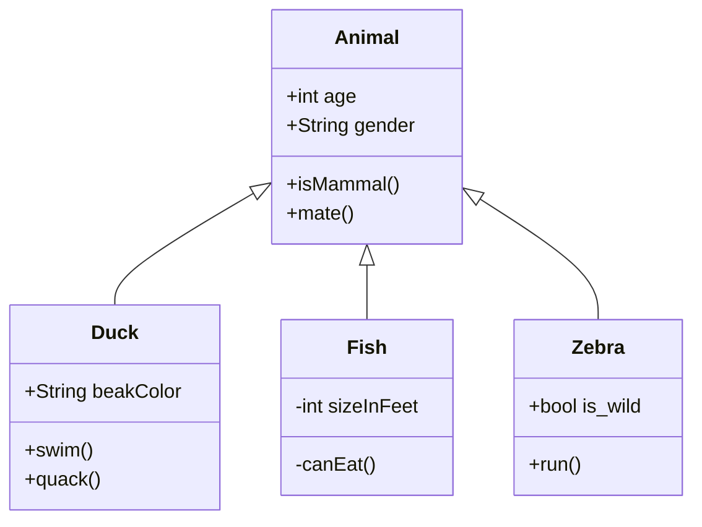
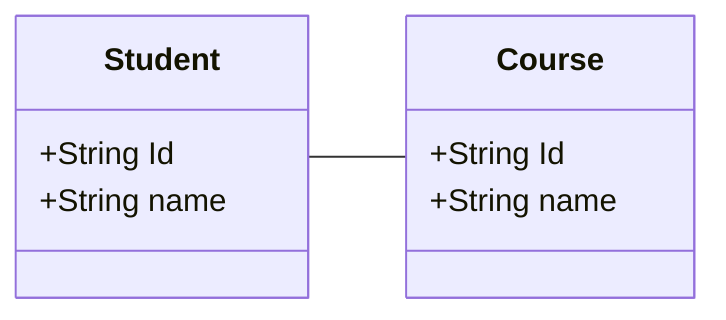

#EngSoft

# Glossary
#2024-03-11

Terminology used in the real world

- Sale
	- commercial transaction between customer and retailer, where customer buys a number of products from the retailer
- Product 
	- ...
# UML
# Class diagram

## Language composed of
- Class
- Instances/object
- AttributeclassDiagram
- Operation
- Association


Example of class diagram at high level using the glossary
![[Pasted image 20240311175037.png]]
#TODO below diagram as the image above

- The `Sale transaction is` an high level model to define the concept, but it's attributes (date, total amount) may not be the only attribute needed to define that class
- `ProductRecord` doesn't have the brand name.

 So ==It's just an intuitive interconnection between the real world and the programming one==
In particular the classes used in the #UML with are:


## Object
- Model of item (physical or within the software system) 
	- a student, a table, a cube etc..
- Characterized by
	- identity
	- attributes (or properties)
	- operations it can perform
	- messages it can receive

## Class
- Describe set of objects
	- generalization of an object
		- people, things, rigid body etc...

example of class:

![[Pasted image 20240311180904.png]]
## Attribute
- Elementary property of classes
	- Name
	- Type
- Attribute associates to each object a value of the corresponding type
	- Name: String
	- ID: Numeric
	- Salary: Currency (String or Numeric)

# Usage of Class Diagram
- Model of concepts (glossary)
- Model of system `(hw + sw) == system design`
- Model of software classes (software design)
- Class in conceptual model (UML class diagram)
	- Ex employee class
- Corresponding entities in software application with different level of abstraction
	- Data layer: employee table in RDB
	- Business logic layer: Employee class in the programming language
	- Presentation layer: form to enter/show employee data and more

# Classes in conceptual diagram
It's possible to have classes to do different things. It is important during the design stage to analyze what different things need to do but with a large scale: it will become very difficult to have the whole pictures if every little aspect of the project is analyzed from the start. Better going top bottom with a general analysis and then specify how each part need to behave.

## Link
Object can have commonality (two students enrolled in the same course), those object have a ***link***

### Association
Analyzing how object may have link together it is possible to analyze the association between different classes as well.
E.g. student in course


### Role
Class person and Class City
Person resident in the city
Person works in the city
Those city may be differs

### Recursive and Roles
- Class person is parent of person
- Class employee supervises employee
- Class person is friend of person
- Depend on the direction one person is the parent of another, and thus the second one is the child of the first one 
![[Pasted image 20240311182651.png]]

### Multiplicity
Describe the maximum numbers of link two object can have
- Car -0...1------mount> 0...4 ->Wheel
	- A car can mount from 0 up to 4 wheels
	- A wheel can be mounted from 0 to at most 1 car (cannot have the same wheel object in more cars!)

Typically only three values are used: 0,1 and \*(many) where:
- min 0 or 1:
	- 0: presence is optional
	- 1: presence is mandatory
- max 1 or \*:
	- 1: each object at most 1 link
	- \*: object can have different links


### Association Class - Example
The association class works when the relation is many to many
![[Pasted image 20240311184229.png]]
==Attention== in this way you cannot show multiple connection with the same class as it will override the value before of it.

To solve this issue it is possible to add an ***intermediate*** class, like a contract class that define the relation between the classes with another class:
![[Pasted image 20240311184508.png]]
==PAY ATTENTION TO THE MULTIPLICITY POSITION==
The amount near a class represent the quantity con link incoming, not the amount of them outgoing, in this case the value are the same and so it's trivial to find the position of them, but be careful for other case were the connection are not symmetrical (e.g. car and wheels)

### Generalization
#2024-03-13
Some class may share some features, there is no need to repeat every common properties across all those classes, the solution is generalization.

Class animal is the generalization that have all the common features of the subclass (child class) specialized from it


It is possible to make subclass of subclass, creating a tree
![[Pasted image 20240313084835.png]]

### Class diagram dos and don't:
some properties can be part of class diagram and others don't

#### Dos
- Physical entities: Person, Car
- Roles: Employee, Director,
- Social

#### Don't
- Use class as attribute
	- e.g. address of a person (particularly true if there is a relation many to many)
- Actions

### Loops
Class diagrams with loop are not wrong per se, but be careful if it's necessary 
  ```mermaid
classDiagram 
flow TD

        University --Office
        Person -- Office
        Person -- University
        class University{
        }
        class Person{
            +SSN
            +name
            +surname
        }
        class Office{
            +ID
        }

```


![[Pasted image 20240313090031.png]]

### Patterns **in** / **is**
If something have a relation a *is* b or a *in* b, then there are some pattern that can be used to create a class diagram 

---
# Scenario
#2024-03-18
It's a sequence of steps (events) that descrive a typical interaction with the system

## Sale1
### Sale1
It describe step by step process

| Step | Description                                 |
| ---- | ------------------------------------------- |
| 1    | Starts sales transaction                    |
| 2    | Read bar code X                             |
| 3    | Retrieve name and price given the barcode X |
|      | Repeat 2 and 3 for all products             |
| 4    | Compute total T                             |
| 5    | Manage payment casch amount T               |
| 6    | Deduce stock amount of product              |
| 7    | Print receipt                               |
| 8    | Close transaction                           |
As it's obvious, it show the step from an high level (if considering the software engineering implementation).

### login
- precondition: not authenticated
- post condition: cashier is authorized and authenticated

### Other
- payment:
	- cash
	- debit card
	- etc.

### Pre / post condition
Precondition:
- Condition to be satisfied before the scenario start
	- bar code X: valid
	- bar code X: corresponds to a product available in the shop

Postcondition:
- Condition satisfied at the end of scenario
	- amount of cash after transaction == amount in cash before + T

### Use case
Set of scenarios with common user goal

Handle sales:
- scenario1: sell 2 product
- scenario2: sell 3 product
- scenario3: sell 2 product but cash not available
	- transaction aborted
- etc.

# Use case diagram
More specific then the context diagram. Define different use case from the actors of the system.
E.g. Use case coupon during transaction that will be validated by cashied. Those coupon can be generated only by Administrator etc.

> Make a contract between the actors of a system about its behavior and thus describe the system's behavior under various condition as it responds to a request.

scenario similar to classes
use case similar to instance of class

## Goal
As a \<*actor type*\>
I want \<*to do something*\>
So that \<*some value is created*\>

## Relationships
### Include
**must** be done
include: (b)<--`<<include>>`---------(a)
b is a subgroup of a. Withdraw cash (a), insert pin (b)
To withdraw cash an actor must insert the pin, so it is a sub category of the goal of an actor

### extension
**optional** feature that might expand the functionality.
If an error then this extension is used. 
E.g. if user has no money then proceed to block transaction.
\^This must not happen at every transaction! only if error (no money) occurs

But not only for errors!
Can be used for optional features!
e.g. supermarket app, if already bought then option to buy again the last order
Not mandatory, but useful feature

## use case vs requirement
not a 1:1 mapping
> a requirement can have multiple use case

---

# Configuration Management
## Motivation
#2024-03-25

Many people need to work in the same documents for a long period of time.
- Where are the documents?
- Who can change what?
- Who did modify what?
- Which was the last working version?
- Documents have dependencies (in most cases not formalized)
	- Formal: `import class / import package`
	- Informal: requirement document, design document, code, test cases

![[Pasted image 20240325174344.png]]

## CM Concepts
- Configuration Item (`CI`)
	- Unit under configuration (one or more files)
- Configuration
	- Sets of `CIs`
- Repository
	- Logical / Physical place where `CIs` are
- Change control models:
	- Lock -> modify -> unlock:
		- the first user lock the `CIs`, and no other users can access it until first user unlocks
			- Pro: no concurrent modification
			- Con: obliges to serialize (first user forgets to unlock)
	- Copy -> modify -> merge: 
		- Pro: many users can checkout in parallel and work on copies
		- Con: conflicts (inconsistent modifications of the same `CI` by different users) are possible, merge operation is delicate, time consuming and possibly error prone
- Chek-in Check-out
	- Formal operation made by a user to notify `CMS`that a `CI` is accessed and modified
	- Check-out: notification that a `CI` is being access by a certain user (read operation)
	- Check-in: notification that a `CI` is no longer accessed (write operation)

![[Pasted image 20240325174755.png]]

### Choices
- What become a `CI`
	- Not all documents/files in a project become `CI`
	- more files means more versioning and more overhead.
	- `.gitignore` for git versioning let ignore some files (IDE configuration for workspace that is user dependent and not useful for the finality of the project)
- Lock model or not
- Time distance between commits
	- every: week? day? hour?
- `CM` manager role
	- defined or not
- CMS tool

## Configuration Management System (CMS)
- Software application capable of
	- Storing and versioning
	- Storing and versioning configurations
	- Change control

Example, the main branch is read-only for everyone except the teachers. We will have access to personal branches with read/write capabilities for ourself.

### Functionalities
- Revert `CI` to a previous version
- Revert configuration back to a previous version
- Compare changes over time
- Control access (user permission)
- Track who does what (read/write)

## Said until now
- Where are the documents
	- repository (GitLab)
- Who can change what, when
	- change control
- Who did modify what
	- tracking
- Which was last working version
	- configurations, versioning

## CMS Taxonomy
There three different taxonomy around the **C**onfiguration **M**anagement **S**ystem
1. Local
	- One machine, local repository (`git init`), not suitable for team work
2. Centralized
	- Server contains repository, clients contains copy (`git remote`)
3. Distributed
	- Server contains repository, each client mirrors the repository locally (`git remote`). 
	- Difference with the centralized approach: versioning is also done locally.

| Local Computer                       | Central Server                       | Distributed System                   |
| ------------------------------------ | ------------------------------------ | ------------------------------------ |
| ![[Pasted image 20240325180342.png]] | ![[Pasted image 20240325180354.png]] | ![[Pasted image 20240325180411.png]] |


## Storage Models
- Deltas:
	- The versioning is done using only the differences between each version
	- PRO: less space used
	- CON: Reconstructing version can take time
- Full copies:
	- Full copy of a `CI` of each version is done
	- Pro: Each version available in ***zero*** time
	- Con: more space is used

### Configuration Management Models (CMM)
- Differences (ex svn)
	- commit by user changes the version of a `CI` (only)
- Snapshot (ex git)
	- Commit by a user defines a new snapshot, including all `CIs`
	- Is made of all `CIs` in the project
	- If a `CI` did not change version, a link the the previous one is used (optimize space)

---
# Git
## History
Create by #LinusTorvalds (Linux creator) in 2005 to support the Linux development.
It was radically different from previous `CMSs` focusing on: 
- Speed
- Support for large project
- Support for distributed development model

## How it works
-  Distributed CMS 
- Snapshots as configuration model 
	- All files together, not one by one 
- Local operations 
	- No information is needed from other computer(s) (server or else) -> speed 
- Integrity 
	- Everything is check-summed before it is stored and is referred to by that checksum -> any change is recognized, no untracked change of any file or directory 
- Additive 
	- Information is added, never deleted -> No worry about messing up things

## GitHub
Online code hosting service built on top of git, mainly used by `OSS` project used by many big corporations.

## GitLab
Another online code hosting service built on top of git.
Main difference is that all the #GitLab infrastructure is open source. Personal hosting for git versioning!


## Client Side
- Folder and file system, working directory or working tree
	- File and folders
- Working copy (WC), index, or staging area
	- Files and folders can be committed but not yet versioned
		- Add: enters a file into working copy
		- Rm: removes file from working copy
- Local repository
	- File and folders versioned
		- Commit: enters all files (snapshot) from WC to local repository
		- Fetch, rebase: copies snapshot from local repository to WC, merge them

### Commit
- Modifies the local repository
- Atomic operation
	- Either succeeds completely or fails completely no middle terms:
		- 9/10 commit succeed, 1/10 fails, all operations failed
- Mandatory to provide a log message with the commit
	- Explain changes made
	- Message becomes part of the history of the repository

### `CIs` states

- Untracked: in the working folder but not tracked (monitored) by git
- Staged (tracked): in WC (or staged area)
	- `git --add`
	- Modified/unmodified
- Committed: versioned, in the local repository
	- `git --commit`
![[Pasted image 20240325182857.png]]

## Server Side
- Remote repository, shared by all clients
	- Push: upload a snapshot from local repository to remote repository (sync of repository)
	- Pull: downloads snapshot from remote repository to local

If conflicts emerges when pushing, the sequence of operation to do is: 
1. Pull
2. Manage all conflicts
3. \[ONLY WHEN CONFLICTS RESOLVED\] Push

Another possibilities is `git pull --rebase` (we're gonna see it later)

## Summary of commands
#cheatsheet
- Set up user 
	- Config –global user.name `«my_name»`
	- Config –global user.email `«my_email»`
- Set up repo 
	- Local
		- Init: creates a local repo in current folder 
	-  Remote 
		- Remote add: connects local repo with remote repo 
- Work on local repo 
	- Add, rm, mv 
	- Commit 
	- Checkout `<hashcode>`
	- Fetch, Rebase 
	- Log, status, diff 
- Work on remote repo 
	- Push, pull

### Set up
- `git config –global user.name «my_name» `
- `git config –global user.email «my_email» `
	- Define name and email of user – to be done once 
- git init 
	- Initializes an empty local repository in the current folder creates a .git directory inside it 
- `git remote add origin «repo_url[.git]» `
	- Adds a new remote repository 
	- Origin is the ‘standard’ name for indicating the principal remote

### Understand
- git status 
	- Show which files are in which state 
- git diff 
	- Similar to previous, but shows also lines changed 
- git log 
	- Show history of what happened in a repository 
- git ls-files 
	- Show tracked files

### Modify Local Repo
- `git add <file>`
	- add `<file>` to the WC (`<file>` changes will be tracked from now on) 
- `git rm <file>` 
	- Remove `<file>` from the WC (changes will not be tracked anymore) and file system 
- `git restore <file>` 
	- Restore file in file system 
- `git mv <file>`
	- Rename a file 
	- Git doesn’t explicitly tracks renaming. No metadata is stored in Git that tells it the file was renamed 
- `git commit `
	- Commit changes from WC to local repo 
- `git commit -a`
	- Commits all tracked files, without need to add them to staging area

### Fetch, Rebase
Updates the working copy with respect to the repository
- Fetch gets changes from the repository
- Merge such changes with the ones you have made to your working copy, if necessary
- Checkout

### Working with remote repo
- git pull 
	- fetch and then merge remote repo on local repo 
- git push 
	- upload local repo on remote repo

### Help commands
- `git help <command>`
- `git <command> -help`


## Common Scenario
###### Start a project from scratch. Create local repo, work on it, sync on remote repo
1. Git init 
2. … work on files file1 file2 file_n 
3. Add file1, file2, filen 
4. Commit 
5. Remote add 
6. push

###### A project has already been created by others, sync locally, work on it, sync remotely 
1. Git init 
2. Git add remote 
3. Pull 
4. .. Work on files 
5. Add 
6. Commit
7. Push

###### Modifying a project, build fails, cant understand why. Retrieve previous version that did build
1. `Git checkout <commit id> `
2. `Git checkout –b <new branch> <commit id>`

## Branching

### Motivation
Two modes of development in a project:
1. Linear (continue adding to the `main branch`)
2. Branching (create a new feature in a different branch that will be merged when it is finished)

| Linear                               | Branching                            |
| ------------------------------------ | ------------------------------------ |
| ![[Pasted image 20240325185050.png]] | ![[Pasted image 20240325185021.png]] |
| ![[Pasted image 20240325185121.png]] |                                      |

### Commands
- Create a new branch nad 
	- `git branch <new_branch_name>`
	- `git checkout -b`

## Data Storage
Git stores a commit object that contains
- A pointer to the snapshot of the content you staged
- Pointers to the commit(s) that directly came before the current one (parent(s))
Staging the files
- checksum each one
- stores that version of the file (*blob*)
- add that checksum to the staging area

### Example
Given a directory with 3 files, stage them all and commit

Git repository now contains five objects 
- one blob for the contents of each of the three files 
- one tree that lists the contents of the directory and specifies which file names are stored as which blobs 
- one commit with the pointer to that root tree and all the commit metadata

First commit tracking three blob (files)
![[Pasted image 20240325185703.png]]
Next commit will store a pointer to the commit that came immediately before it (linked list!)
![[Pasted image 20240325190111.png]]

## Branches
A branch in Git is simply a lightweight movable pointer to one of these commits
- `Git branch <name> // creates a branch, ie creates a pointer`
`HEAD` Points to the current branch
- Default branch name in git is master/main (debated for master / slavery reference)
For every commit `HEAD` moves automatically to the most recent one, although it can be moved manually to review a particular version of a `CI`:
- `Git checkout <name> // HEAD now points to <name>`
- `Git checkout –b <new branch> <commit id> // creates branch and moves HEAD`


# UI
## Part 2
#2024-04-15

Minimal change can greatly improve the usage of the product.
Example: kitchen stove knobs. Very little change in the position of the knobs make much more intuitive sense of which one is used for what

| Same line                            | Two different line                   |
| ------------------------------------ | ------------------------------------ |
| ![[Pasted image 20240415175621.png]] | ![[Pasted image 20240415175628.png]] |


# Validation & Verification
One of the important part during the development of a software.
> new terminology: Defect, Fault, Failure

Defect is used to refers both to fault and failure.
## Bike example
Requirement
R1 bike must transport person around

Failure:
user fall down from a bike
R1 not satisfied

Fault:
bike problems (saddle mounted too high, wheels too far apart)
- developer fault, need to fix the issue
	- If saddle too high, configuration problem, easy to fix
	- if wheels too far apart design problem, need to redesign the whole bike

outside problem (user don't know how to bike, pot hole in the street)
 - not a developer responsibility
	 - user need to learn how to bike to not break the bike
	 - government insurance to pay the damage if the road are broken

The terminology defect is used to indicate both fault and failure.

## Warranty

The product comes with a warranty, while the product is in production the developer pays, after the deployment the developer still pays until warranty expires, then the customer is responsible for its own damage.

## Technical debt
tradeoff between quality vs non quality

When implementing some function in a easier way now will come back with interest later when needed.
Duplicated code, bad written code ect. will need more attention later.

Try to reduce the debt as much as possible while remaining inside the available margin of available cost

### Example
`int a, int aa, int aaa`
- need to understand later the mind of who wrote the code to understand what does this variable does

copy repetition:
- later found a bug and thus modify the code, but since the code was copied in multiple places some of them may go under the radar resulting in the bug still present under certain condition (worst case to debug)

## V&V techniques
### Types
- static: pull request need maintainer to manually inspect the code
- dynamic: **CI** automation to found bug in the code

### per activity
- Requirements
	- inspection of requirement document (static)
	- GUI prototype (static)

For each part is useful to make a legal contract to state the validity of the proposed product to the user. This will make easier to avoid change of mind of the customer and pays the cost.

## Inspection
Inspect the various phase of development to find bug early in the process, tradeoff between time spent developing and avoid finding bug later with the result of more time used to delivery the requested product.